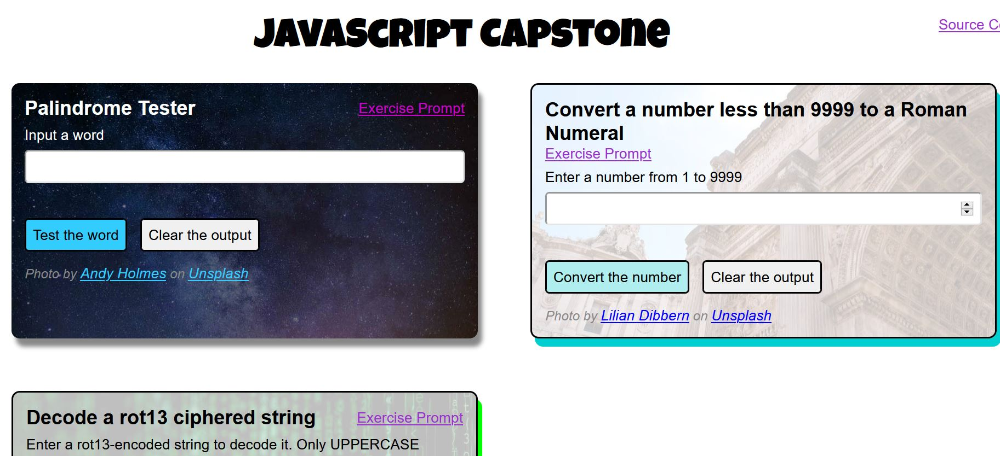
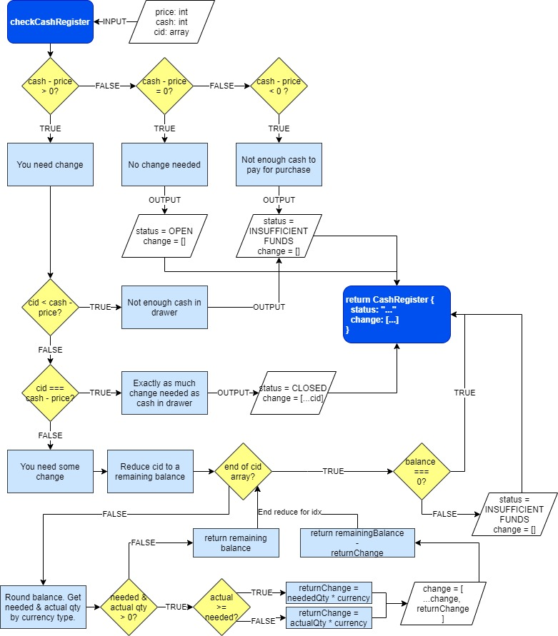

# JavaScript Capstone

Solutions to the 5 final projects for the [freeCodeCamp JavaScript Algorithms and Data Structures](https://www.freecodecamp.org/learn/javascript-algorithms-and-data-structures/) certificate.



## Tech Stack

_This project was bootstrapped with [Create React App](https://github.com/facebook/create-react-app)._

- JavaScript Framework / Library: React
- Unit Testing: Mocha
- Styling: Sass
- Hosting: Google Firebase
- Continuous Integration: GitHub Actions

## Live Preview

### **[https://js-capstone-3c74d.web.app/](https://js-capstone-3c74d.web.app/)**

## Using the project

### Run it locally

1. Clone the remote. `git clone https://github.com/hdevilbiss/js-capstone.git`
1. Be able to use Node.
1. Install Node dependencies. `npm i`
1. Start the server. `npm start`

### Run the test suite

1. Assuming dependencies are installed, run `npm test`.

## Google Firebase

### Learn more about [setting up Firebase deployment](https://github.com/hdevilbiss/js-babel-firebase/wiki/Deploy-with-Firebase)

## Challenges

Sometimes, the details are so center-focus, that the bigger picture becomes blurred.

Here are some of the obstacles that I had when creating this app.

### **[Wiki on Challenges](https://github.com/hdevilbiss/js-capstone/wiki/Challenges)**

```markdown
🌳🌳🌳🌳🌳🌳
🥚🐉🏯 ⚔️  🌳
🌳🌳🌳🌳🌳 🌳
```

## Miscellaneous

The CashRegister took me about 8 days to complete. Charting out the logic helped in the process.


